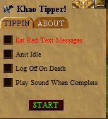

# KHAO Tipper
KHAO Tipper Decal Plugin Asheron's Call

A [Decal](http://www.decaldev.com/) utility plugin for use with private Asheron's Call emulation servers

<picture>
 <source media="(prefers-color-scheme: dark)" srcset="KhaoTipper.jpg">
 <source media="(prefers-color-scheme: light)" srcset="KhaoTipper.jpg">
 
</picture>

<picture>
 <source media="(prefers-color-scheme: dark)" srcset="tipped_pack_cow.jpg">
 <source media="(prefers-color-scheme: light)" srcset="tipped_pack_cow.jpg">
 
</picture>

# Features include:

* Tips cows to complete the Cow Tipper quest
* Squelch red client status messages
* Anti Client idle
* Logout on death
* Play sound when tipping completes

# Installing

* See the [Releases](https://github.com/FtuoilXelrash/KHAOTipper/releases/tag/v2.9.0) for the latest release. 
* Install as you normally would for any Decal plugin distributed as a DLL.
* Final Release 10/01/2008 Version 2.9.0

# Prerequisites
* [Decal](http://www.decaldev.com/) 
* [ACEmulator](http://emulator.ac/)

# Contact
- Creator
[Ftuoil Xelrash Discord Channel](https://discord.gg/G8mfZH2TMp)
